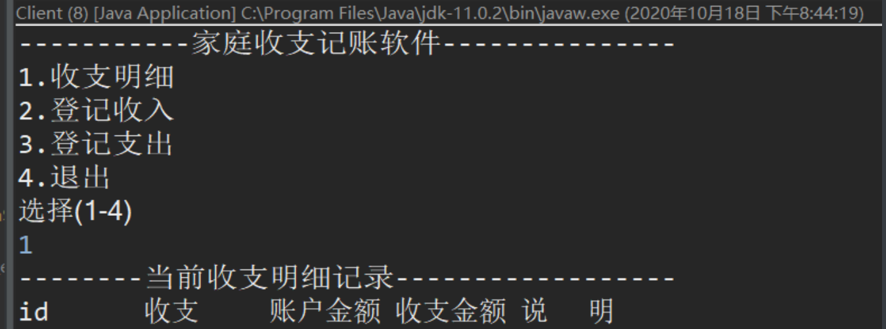
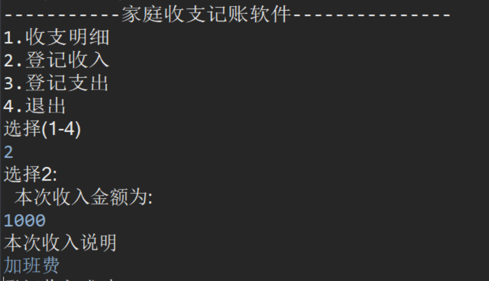
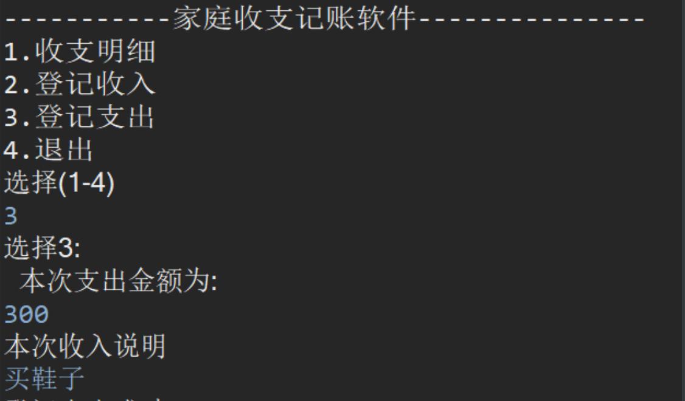
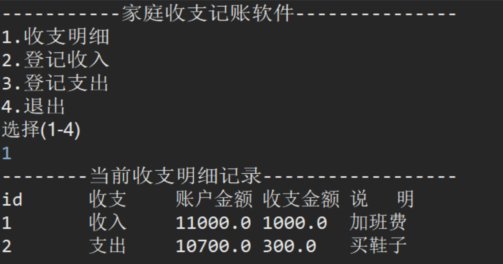

**界面及操作过程如下所示：  
\-----------------家庭收支记账软件-----------------  
1 收支明细  
2 登记收入  
3 登记支出  
4 退 出  
请选择(1-4)：**  
选择1：  
\-----------------当前收支明细记录-----------------  
收支 账户金额 收支金额 说 明  
收入 11000 1000 劳务费  
支出 10200 800 物业费  
选择2：  
本次收入金额：1000  
本次收入说明：劳务费\_  
选择3：  
本次支出金额：800  
本次支出说明：物业费\_  
根据需求提取出类，属性和方法，完成上述功能

运行结果
----

  

  

  

